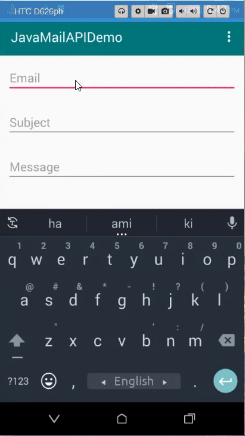

# JavaMailAPIDemo
This is a android app practice project. I have implemented JAVAMIAL API with Gmail.

## App overview 

## Project Resource
[LINK TO DOWNLOAD LIBS FILE](https://bit.ly/2KIyiGs)

[LINK TO JAVAMAIL API CLASS](https://bit.ly/2KIU39i)

[LINK TO YOUTUBE TUTORIAL](https://bit.ly/31P9na1)

public class Utils {

    //This is your from email
    public static final String EMAIL = "Set your from gmail here";

    //This is your from email password
    public static final String PASSWORD = "Set your from gmail password";
}
